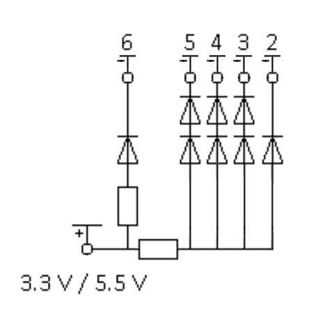

# Electronic dice

A program to show random dice numbers on a breadboard with 7 leds.

## Electric diagram

The arduino output 6 is used for error led.

## Dice outputs

- The OUT_1 is the arduino output 2.
- The OUT_2 is the arduino output 3.
- The OUT_3 is the arduino output 4.
- The OUT_4 is the arduino output 5.

When an output is on LOW position, the associated led are turned on, if HIGH, turned off.